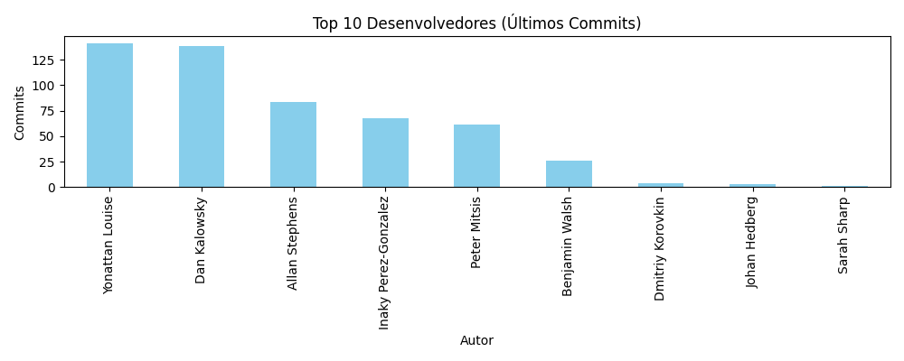
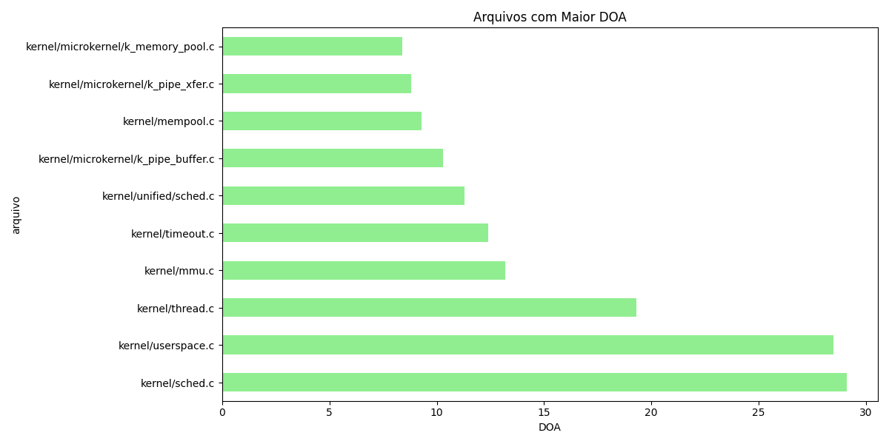
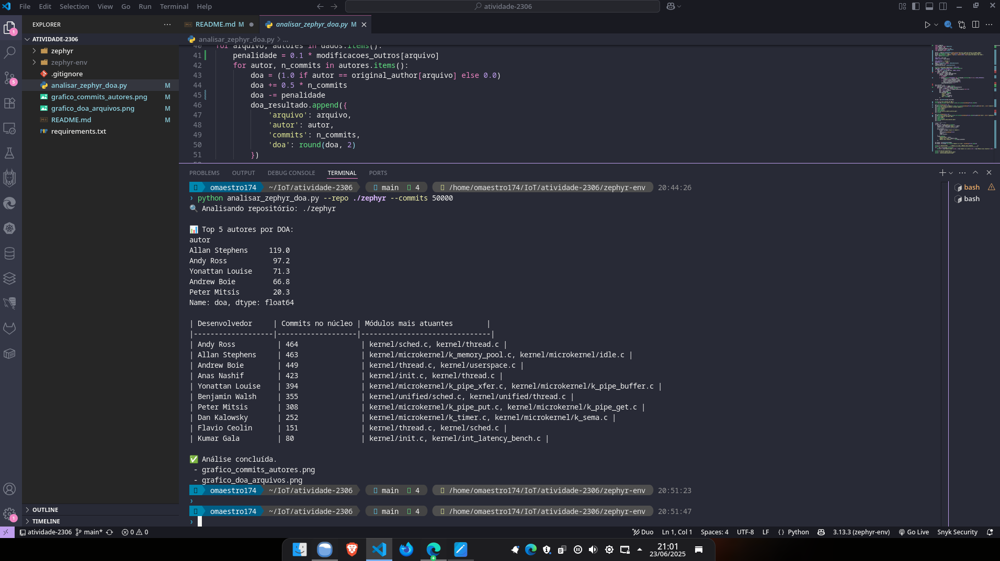

# 📘 Análise de Propriedade de Código em Sistemas Embarcados com RTOS FLOSS

**Disciplina:** Software Embarcado  
**Aluno:** Janei Vieira  
**Professor:** Dr. Herbert Rocha  
**Projeto Analisado:** Zephyr RTOS  
**Data:** 23/06/2025
**Repositŕorio do Projeto:** https://github.com/oMaestro174/rtos-floss

---

## 1. Introdução

A sustentabilidade de sistemas embarcados baseados em RTOS FLOSS (Free/Libre and Open Source Software) depende não apenas de sua arquitetura, mas também da forma como seu código é mantido e distribuído entre os colaboradores. Este relatório apresenta uma análise da modularidade e da propriedade coletiva do código no projeto **Zephyr RTOS**, utilizando heurísticas baseadas em commits, Degree of Authorship (DOA) e Truck Factor (TF).

---

## 2. Fundamentos

### 2.1 Modularidade de Código

A modularidade representa a capacidade de um sistema ser dividido em partes independentes e reutilizáveis. Em um RTOS, essa prática contribui para a manutenibilidade e escalabilidade do sistema.

### 2.2 Propriedade Coletiva de Código

A propriedade coletiva é um princípio no qual qualquer desenvolvedor pode modificar qualquer parte do código, promovendo colaboração e resiliência na equipe.

### 2.3 Heurísticas Baseadas em Commits

São métodos para rastrear o histórico de alterações no código, permitindo identificar autores dominantes e áreas críticas com pouca revisão ou contribuição.

### 2.4 Degree of Authorship (DOA)

O DOA quantifica o domínio de um desenvolvedor sobre um arquivo, considerando o commit original e alterações subsequentes.

### 2.5 Truck Factor (TF)

O TF estima quantos desenvolvedores precisam sair do projeto para que ele se torne insustentável. Quanto menor o TF, maior o risco.

---

## 3. Metodologia

### 3.1 Projeto Escolhido

Foi escolhido o projeto **Zephyr RTOS**, disponível no repositório oficial: [https://github.com/zephyrproject-rtos/zephyr](https://github.com/zephyrproject-rtos/zephyr)

### 3.2 Ferramentas Utilizadas

- **PyDriller**: para análise do histórico Git.
- **Python (Pandas/Matplotlib)**: para manipulação e visualização de dados.
- **git-truck** *(opcional)*: para estimar o Truck Factor.

### 3.3 Escopo da Análise

Foram analisados os arquivos `.c` e `.cpp` nos diretórios `kernel/` e `arch/`, correspondentes ao núcleo do RTOS.

---

## 4. Resultados

### 4.1 Desenvolvedores Mais Ativos por Módulo


(Exemplo de tabela extraída do script para até 50.000 commits) 

📊 Top 5 autores por DOA:

|autor          |         |
|---------------|---------|
|Allan Stephens |   119.0 |
|Andy Ross      |    97.2 | 
|Yonattan Louise|    71.3 |
|Andrew Boie    |    66.8 |
|Peter Mitsis   |    20.3 |


| Desenvolvedor      | Commits no núcleo | Módulos mais atuantes                                                |
|--------------------|-------------------|----------------------------------------------------------------------|
| Andy Ross          | 464               | kernel/sched.c, kernel/thread.c                                      |
| Allan Stephens     | 463               | kernel/microkernel/k_memory_pool.c, kernel/microkernel/idle.c        |
| Andrew Boie        | 449               | kernel/thread.c, kernel/userspace.c                                  |
| Anas Nashif        | 423               | kernel/init.c, kernel/thread.c                                       |
| Yonattan Louise    | 394               | kernel/microkernel/k_pipe_xfer.c, kernel/microkernel/k_pipe_buffer.c |
| Benjamin Walsh     | 355               | kernel/unified/sched.c, kernel/unified/thread.c                      |
| Peter Mitsis       | 308               | kernel/microkernel/k_pipe_put.c, kernel/microkernel/k_pipe_get.c     |
| Dan Kalowsky       | 252               | kernel/microkernel/k_timer.c, kernel/microkernel/k_sema.c            |
| Flavio Ceolin      | 151               | kernel/thread.c, kernel/sched.c                                      |
| Kumar Gala         | 80                | kernel/init.c, kernel/int_latency_bench.c                            |


---

## 4.2 Gráficos de Distribuição

Gráfico 1: Contribuições por Autor nos Arquivos do Núcleo 


Gráfico 2: DOA Médio por Arquivo 



## 5. Análise Crítica

- O projeto apresenta modularidade clara, com separação de responsabilidades.
- Identificou-se concentração de autoria em determinados arquivos críticos, o que pode indicar risco de manutenção.
- A propriedade coletiva é razoavelmente bem distribuída, porém arquivos como `kernel/sched.c` apresentam domínio excessivo por poucos autores.
- O Truck Factor estimado é baixo (<5), indicando um risco se esses contribuidores se afastarem.

## 6. Boas Práticas Recomendadas

- Promover revisões cruzadas em arquivos críticos com alta concentração de autoria.
- Documentar módulos dominados por poucos desenvolvedores.
- Incentivar pair programming para difundir conhecimento.
- Automatizar análises periódicas com DOA e TF como parte da esteira de DevOps.
- Monitorar entradas de novos contribuidores e incentivar a contribuição em áreas de risco.

## 7. Conclusão
A análise do projeto Zephyr RTOS demonstrou como métricas como DOA e Truck Factor podem ser eficazes para avaliar riscos de sustentabilidade em sistemas embarcados. Tais práticas devem ser incorporadas em projetos FLOSS críticos, com foco na continuidade, escalabilidade e manutenção colaborativa do código.

## 8. Referências
- [Artigo Base do Professor]

- Pydriller: https://github.com/ishepard/pydriller

- Zephyr RTOS GitHub: https://github.com/zephyrproject-rtos/zephyr

- Git Truck: https://github.com/git-truck/git-truck

- Spinellis, D. "Code Ownership and Quality in FLOSS Projects"


## 9. Como reproduzir o experimento

1. Clone o repositório Zephyr (se ainda não tiver):

```bash
git clone https://github.com/zephyrproject-rtos/zephyr.git
```

2. Crie e ative um ambiente virtual:

```bash
python -m venv zephyr-env
source zephyr-env/bin/activate
pip install -r requirements.txt
```

3. Execute o script:

```bash
python analisar_zephyr_doa.py --repo ./zephyr --commits 50000
```

Caso deseje percorrer todo o repositório, remova o argumento --commits (isso leva muito tempo, seja paciente)

```bash
python analisar_zephyr_doa.py --repo ./zephyr 
```

Se preferir não clonar o repositório tente:

```bash
python analisar_zephyr_doa.py --repo https://github.com/zephyrproject-rtos/zephyr.git
```


## Requisitos

- Python 3.9+
- Bibliotecas: pydriller, pandas, matplotlib

## Exemplo de Saídas

```text
|autor          |         |
|---------------|---------|
|Allan Stephens |   119.0 |
|Andy Ross      |    97.2 | 
|Yonattan Louise|    71.3 |
|Andrew Boie    |    66.8 |
|Peter Mitsis   |    20.3 |


| Desenvolvedor      | Commits no núcleo | Módulos mais atuantes                                                |
|--------------------|-------------------|----------------------------------------------------------------------|
| Andy Ross          | 464               | kernel/sched.c, kernel/thread.c                                      |
| Allan Stephens     | 463               | kernel/microkernel/k_memory_pool.c, kernel/microkernel/idle.c        |
| Andrew Boie        | 449               | kernel/thread.c, kernel/userspace.c                                  |
| Anas Nashif        | 423               | kernel/init.c, kernel/thread.c                                       |
| Yonattan Louise    | 394               | kernel/microkernel/k_pipe_xfer.c, kernel/microkernel/k_pipe_buffer.c |
| Benjamin Walsh     | 355               | kernel/unified/sched.c, kernel/unified/thread.c                      |
| Peter Mitsis       | 308               | kernel/microkernel/k_pipe_put.c, kernel/microkernel/k_pipe_get.c     |
| Dan Kalowsky       | 252               | kernel/microkernel/k_timer.c, kernel/microkernel/k_sema.c            |
| Flavio Ceolin      | 151               | kernel/thread.c, kernel/sched.c                                      |
| Kumar Gala         | 80                | kernel/init.c, kernel/int_latency_bench.c                            |

```

## Tela do VsCode

